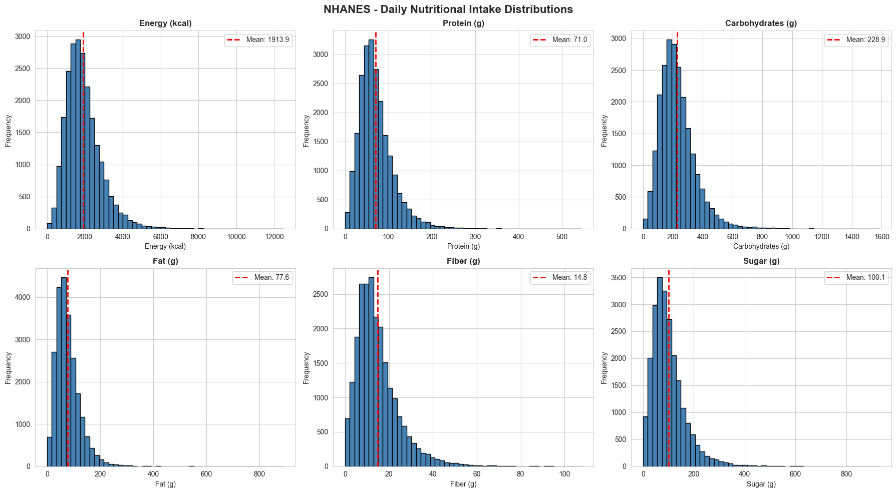
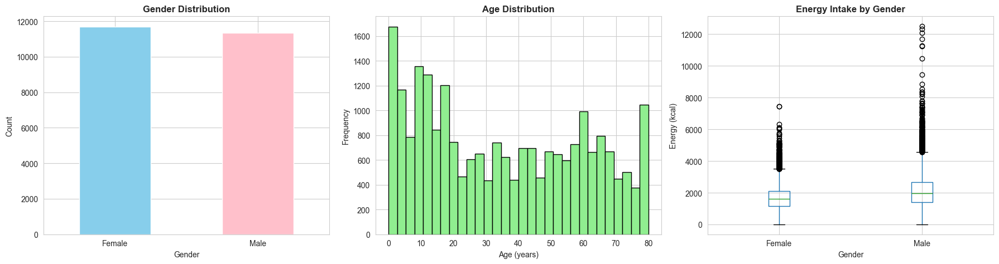
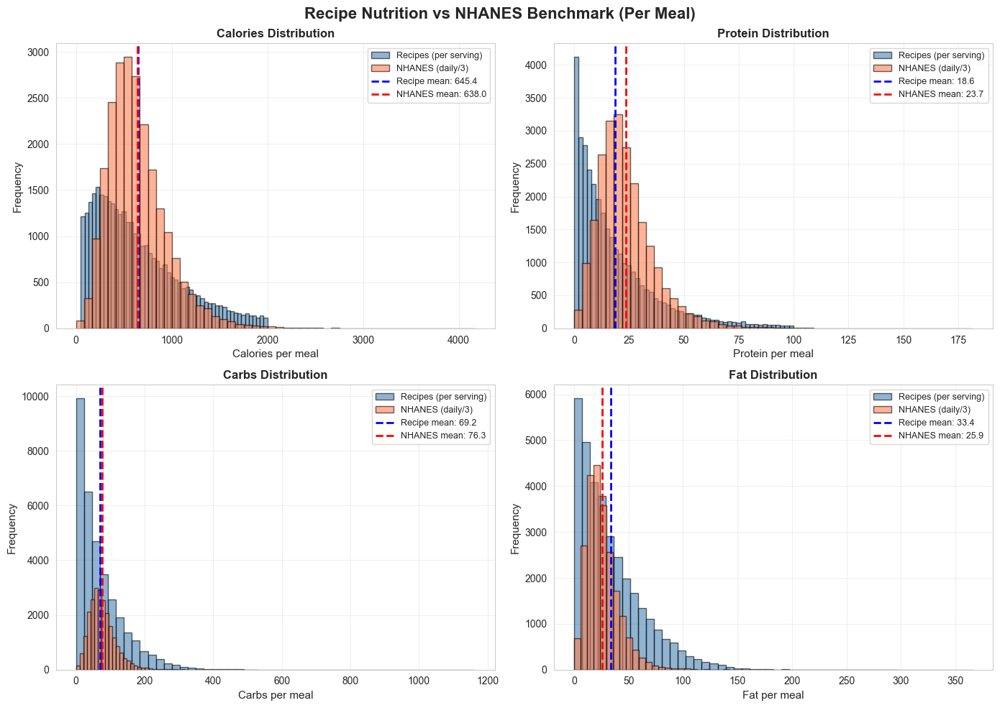
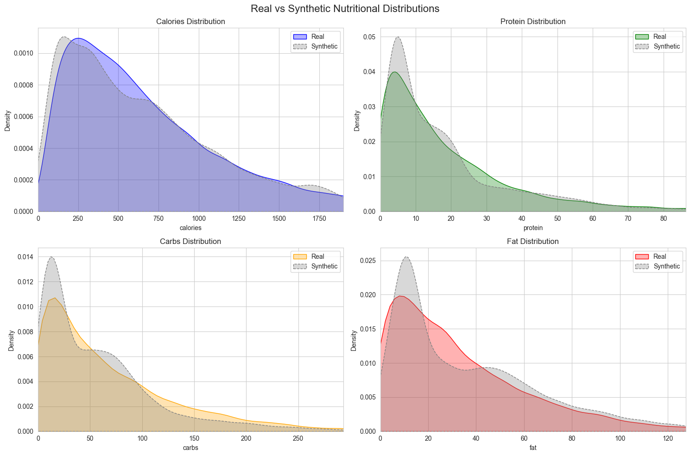
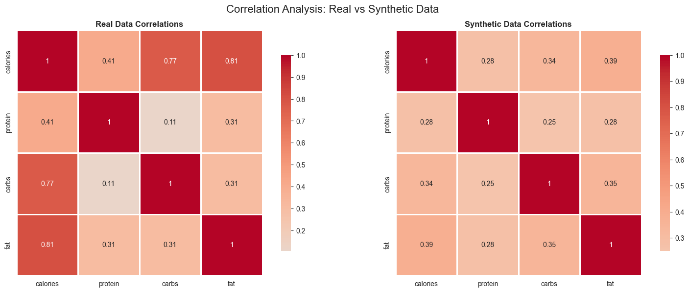
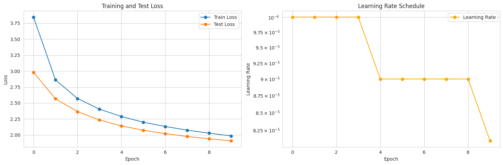
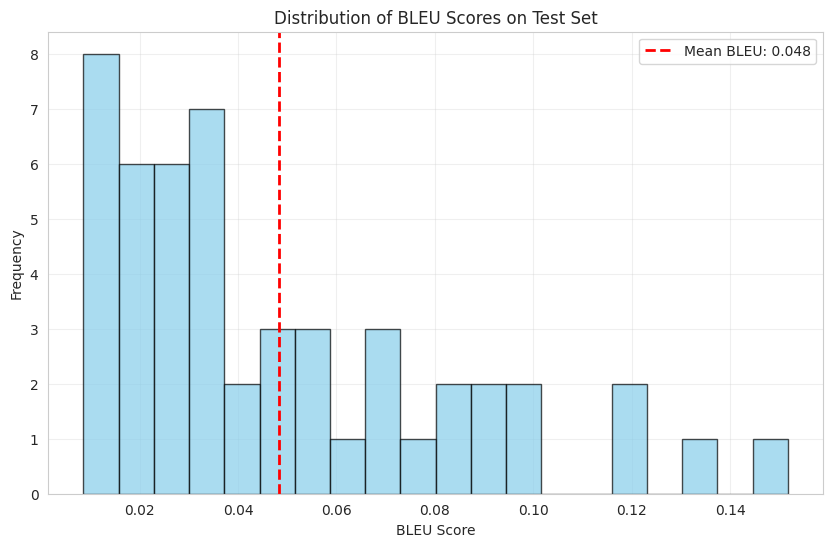

# NutriGen: A Multi-Modal Recipe Generative Framework for Personalized Nutritional Synthesis

## Overview

**What is this project?**
NutriGen is a multi-modal generative framework designed for personalized nutritional synthesis. It addresses the critical challenge of inaccurate and inconsistent nutritional information in online recipes by implementing a robust data pipeline. This framework calculates precise nutritional data from scratch by parsing unstructured recipe ingredients and matching them against the comprehensive Open Food Facts database. Building on this verified foundation, the project leverages a suite of generative AI models: a **CTGAN** to synthesize realistic nutritional profiles for tailored dietary needs, and a **Transformer model** to generate complete, coherent cooking instructions from the ingredient and nutritional data.

**Why does it matter?**
In an age of health-conscious eating and personalized nutrition, reliable data is paramount. Most online recipes provide opaque and untrustworthy nutritional estimates. NutriGen aims to bring transparency and accuracy to recipe nutrition, empowering users to make informed dietary choices. By generating novel cooking instructions from specified nutritional targets, we explore the creative frontier of AI in the culinary arts, paving the way for advanced applications in dynamic meal planning and automated recipe creation.

**Who is this for?**
This project is for data scientists, nutritionists, developers in the food-tech space, and anyone interested in the application of NLP, generative models, and data engineering to solve complex, real-world problems.

**When was this developed?**
This project was developed as a comprehensive portfolio piece, with the primary analysis and model training conducted in late 2025.

## The Working Process: From Problem to Solution

Our methodology is broken down into four key stages, transforming raw, unstructured recipe data into a generative model capable of creating new instructions.

### Step 1: Establishing a Data Foundation & Nutritional Benchmark

The project began by aggregating three diverse datasets to build a holistic view of food consumption and recipe composition.

### Data Sources

**Allrecipes Dataset**
*The primary source of raw recipe text, providing the ingredients and instructions for the core analysis and generation tasks.*

| Source                        | Type                      | Records            | Key Features Used                        |
| ----------------------------- | ------------------------- | ------------------ | ---------------------------------------- |
| Allrecipes.com (Scraped Data) | Recipe Text & Metadata    | ~38,000 recipes    | `title`, `ingredients`, `instructions`     |

**Open Food Facts (OFF)**
*The nutritional backbone of the project, used as a ground-truth database to calculate accurate nutrition for individual ingredients.*

| Source             | Type                         | Records                | Key Features Used                                                              |
| ------------------ | ---------------------------- | ---------------------- | ------------------------------------------------------------------------------ |
| Open Food Facts    | Nutritional Product Database | ~4.1 million products  | `product_name`, `energy_100g`, `proteins_100g`, `carbohydrates_100g`, `fat_100g` |

**National Health and Nutrition Examination Survey (NHANES)**
*A statistical benchmark of real-world dietary intake, used to validate the plausibility of the calculated recipe nutrition.*

| Source                               | Type                            | Records                                                   | Key Features Used                                                |
| ------------------------------------ | ------------------------------- | --------------------------------------------------------- | ---------------------------------------------------------------- |
| Centers for Disease Control (CDC)    | Health and Nutrition Survey     | ~23,000 daily records (from ~12,400 respondents, 2017-2020) | `energy_kcal`, `protein_g`, `carbs_g`, `fat_g`, demographic data |

---
***Note on Images:*** *To display the graphs, save the plots generated by the notebooks into an `assets/` directory in your project's root folder using the filenames specified below.*


*A visualization showing the distribution of daily calorie, protein, carb, and fat intake from the NHANES dataset. This sets the baseline for what a typical daily intake looks like.*


*A set of bar and box plots showing the demographic breakdown of the NHANES respondents and how nutritional intake varies, for instance, by gender.*

### Step 2: Engineering the Nutritional Calculation Pipeline

This stage was the project's core data engineering challenge: to replace unreliable, scraped nutritional data with verifiable, calculated values.

*   **Advanced Ingredient Parsing:** A custom function was developed to intelligently parse unstructured ingredient strings (e.g., "1 (8 ounce) can crushed pineapple, drained") into structured components: a numeric `quantity`, a standardized `unit` (e.g., 'cup', 'oz'), and a cleaned `ingredient name`.

*   **High-Speed Fuzzy Matching:** We matched the cleaned ingredient names from every recipe against the 4 million products in the Open Food Facts database. This was achieved using `rapidfuzz`, a high-performance fuzzy string matching library. This critical step allowed us to link a recipe ingredient like "all-purpose flour" to a specific food product with known nutritional values, achieving **72.9% coverage** across nearly 19,000 unique ingredients.

*   **Nutrition Aggregation and Validation:** With each ingredient successfully matched, we calculated the total calories, protein, carbs, and fat for each recipe. The system aggregated the nutritional values of its components, carefully adjusted for the specified quantities and units. The final per-serving nutrition was then benchmarked against the NHANES per-meal averages to ensure our calculations were realistic, ultimately producing a clean, reliable dataset for over **33,000 recipes**.


*A comparative histogram showing the distribution of per-meal nutrition from our calculated recipes against the NHANES daily intake (divided by three). This visual validates that our recipe data is nutritionally plausible.*

### Step 3: Generating Synthetic Nutritional Profiles with a CTGAN

To explore the possibility of creating recipes for specific dietary needs, we moved into the realm of generative AI.

*   **Objective:** We trained a **Conditional Tabular Generative Adversarial Network (CTGAN)** to learn the complex, multi-dimensional statistical distribution of our newly calculated nutritional data.

*   **Application & Evaluation:** The trained CTGAN can generate new, synthetic, yet highly realistic nutritional profiles on demand. For instance, it can produce data for recipes that are "high-protein and low-fat" while maintaining plausible correlations between all nutrients. The model's performance was validated by comparing the statistical properties (like mean, standard deviation, and correlations) of the synthetic data to the real data, showing a very close match.

*A Kernel Density Estimate (KDE) plot overlaying the distributions of real and synthetic data for key nutrients, demonstrating the model's ability to capture the original data's structure.*


*Side-by-side heatmaps showing the correlation matrix for nutrients in the real dataset versus the synthetic one, proving the GAN maintained the complex relationships between variables.*

### Step 4: Generating Cooking Instructions with a Transformer Model

The final and most ambitious stage was to build a model capable of writing complete, coherent cooking instructions from scratch.

*   **Model Architecture:** We implemented a **sequence-to-sequence Transformer**, a state-of-the-art neural network architecture for NLP tasks. The model's input was a formatted string containing a recipe's ingredients and its target nutritional profile, and its output was the step-by-step instructions.

*   **Training and Refinement:** Training such a complex model presented challenges, including instability and nonsensical output in early iterations. These issues were resolved by implementing a more sophisticated training regimen, which included a **warm-up learning rate scheduler**, proper weight initialization, and scaled embeddings to ensure stable convergence. The model was trained on our cleaned dataset of over 26,000 high-quality recipes.

*   **Evaluation and Results:** We evaluated the model's performance using the **BLEU score**, a standard metric for measuring the similarity between machine-generated text and a human reference. While the quantitative scores indicate that the model is a strong baseline with room for improvement, qualitative analysis shows it successfully learned to generate grammatically correct and contextually relevant instructions that follow a logical cooking sequence.


*A line chart showing the convergence of training and validation loss over epochs, indicating that the model was learning effectively.*


*A histogram showing the distribution of BLEU scores, which quantifies the quality of the generated recipe instructions against the original text.*

## How to Run This Project

Follow these steps to set up the environment, process the data, and run the models.

### Prerequisites

*   Python 3.8+

### Setup and Installation

First, clone the repository and install the required dependencies.

```bash
# Clone the repository to your local machine
git clone https://github.com/jaypatel35/Data-Science-Practicum---2

# It is highly recommended to use a virtual environment
python -m venv venv
source venv/bin/activate  # On Windows, use `venv\Scripts\activate`

# Install the required Python packages
pip install -r requirements.txt
```

### Data Acquisition

The project requires three main datasets. The notebooks will download two of them automatically.

1.  **Allrecipes Dataset**: Download the `Allrecipes.csv` file from its source (e.g., Kaggle) and place it in the root directory of this project.
2.  **Open Food Facts**: Run the `open_food_facts_data.ipynb` notebook. The initial cells will download the complete OFF database (~10 GB, compressed). This will take a significant amount of time.
3.  **NHANES Data**: Run the `NHANES_data.ipynb` notebook. The initial cells will download the required survey data directly from the CDC's website.
